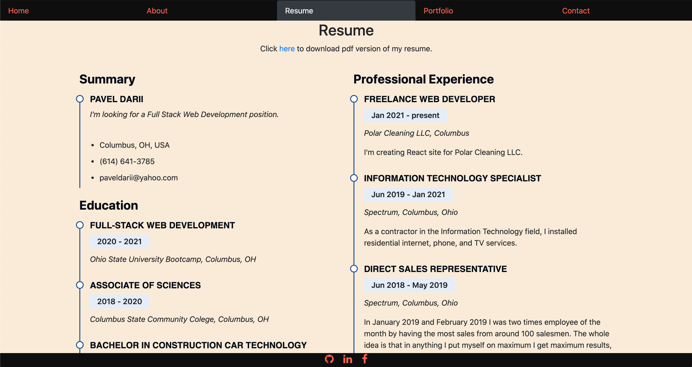
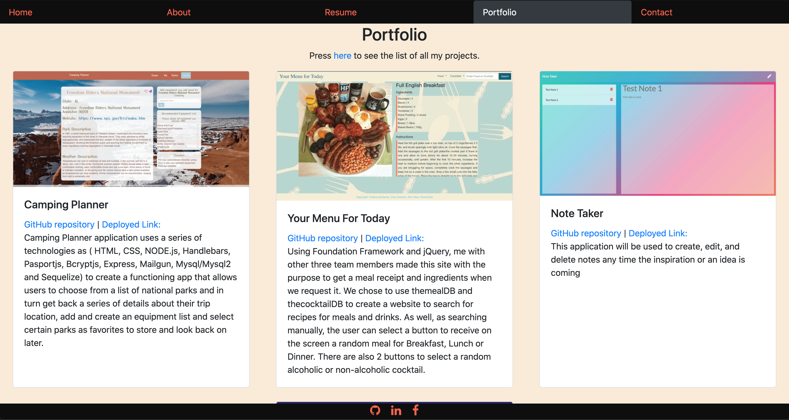

# React iPortfolio 

## Table Of Contents

1. [License](#license)

2. [Description](#description)

3. [Usage](#usage)

4. [Questions](#questions)

## Description

Deployed link: [https://paveldarii.github.io/](https://paveldarii.github.io/)

iPortfolio 2.0 is created with Node/React.

This site has most of the data which a potential employer might want to know.

## Usage

Some ideas about how the site looks and what how it can be used is represented in pictures bellow.

Resume page

Portfolio page

## Questions

My GitHub profile: [https://github.com/paveldarii](https://github.com/paveldarii).

My email address: paveldarii@yahoo.com

## License

[The MIT License](https://opensource.org/licenses/MIT/)
